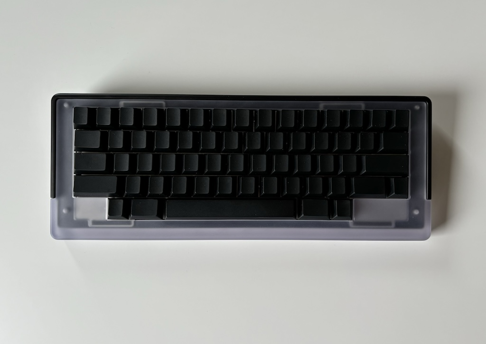

# felk60 - An EC/Topre keyboard.

## Features
- Two-piece design to allow for multiple physical layouts such as HHKB, Tsangan, WKL, WK etc.
- Gasket mounted
- Designed for [EC60 by Cipulot](https://github.com/Cipulot/EC60)
- Unified daughterboard
- SKUF feets

## Specifications
- 7° typing angle

## Notes
- The .step file for the top piece has 4x holes for M3. If you intend to get this manifactured in plastic such as PC, make sure to adjust it for threaded inserts instead.
- For proper EC compatibilty the plate needs to be 1.2mm, preferably in stainless steel so it allows for durable threads.
- Designed and tested around 2mm thick gaskets for a stiff mount (50% compression). If you want a less stiff mount, go for something thinner but it needs to be at least 1.2mm or so.
